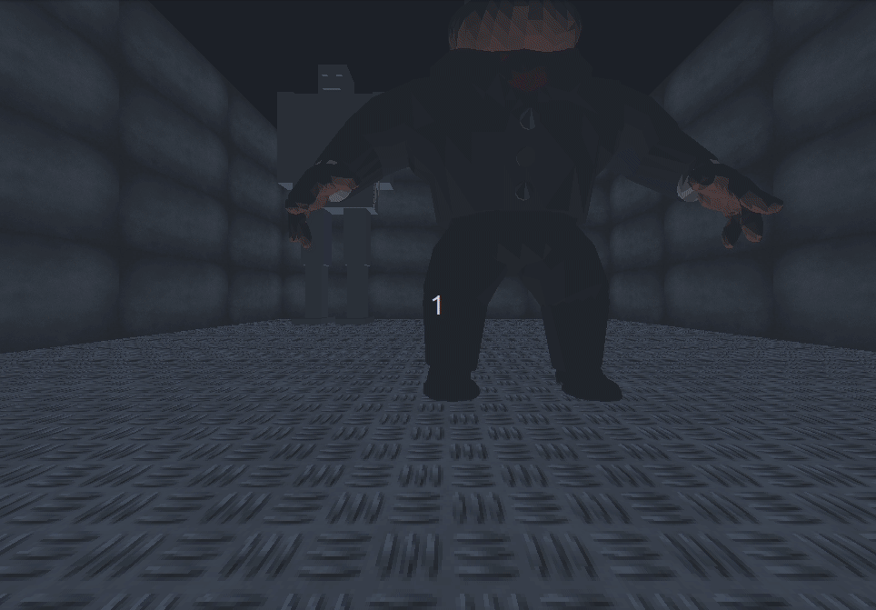
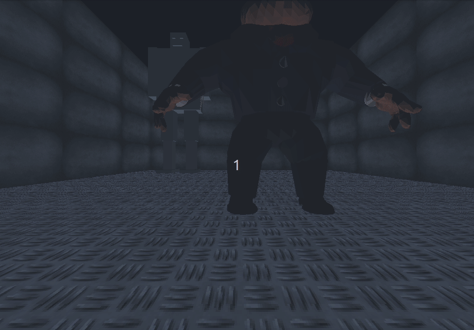
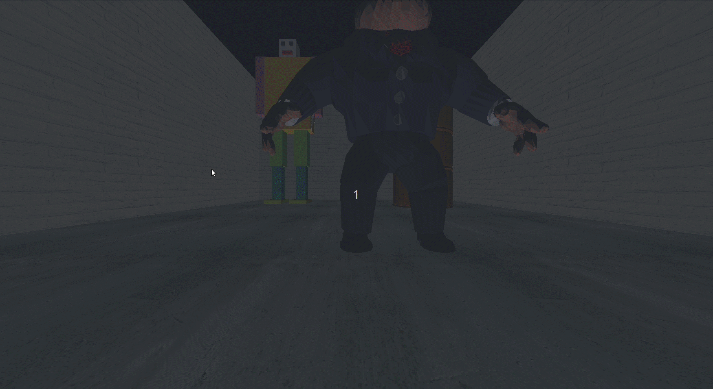

# Computer graphics final assessment report

<Strong> Group No. 6 </Strong>

| Animation     | Sec | B.N |           Email            |
| ------------- | :-: | :-: | :------------------------: |
| Nada Ashraf   |  2  | 38  |  nadaashraf11@icloud.com   |
| Khalid Maher  |  1  | 28  |   khaledbedda12@gmai.com   |
| Ali Gamal     |  2  |  9  | ali.gamal.elgaml@gmail.com |
| Ayman Mohamad |  1  | 20  | aymanwadhaf2017@gmail.com  |

## About the project

## Snapshots

 
 
    

 
 
    

 
 
    

## Dependencies

## Compile and run

`sh compile_run.sh`

## Keyboard controls

### Animation

| Animation           | key |
| ------------------- | :-: |
| Robot Walking       |  n  |
| Robot Staning       |  m  |
| Robot Running       |  b  |
| Robot Turning Left  |  z  |
| Robot Turning Right |  x  |
| Robot Killing a man |  k  |

### Camera

| Animation       | key |
| --------------- | :-: |
| Moving Forward  |  w  |
| Moving Backward |  s  |
| Turning Right   |  d  |
| Turning Left    |  a  |
| Turning Up      |  q  |
| Turning Down    |  e  |

## Objects

There's 2 objects used in the application:

1. Object of a man who get killed by the robot
2. Object of a sword which the robot use to kill the man

## Textures

The user can change between several textures using a menu opens on right click.

## Implementation details

The application cosists of the following classes:

| Class         |                     Description                      |
| ------------- | :--------------------------------------------------: |
| RobotBody     |        Draw and control robot body movements         |
| Camera        |           Initializes and controls camera            |
| Surface       | Draws a rectangular surface with a Texture put on it |
| ObjectHandler | Loading object files and drawing them into the scene |

### Camera

- For camera movements we used the function `rotate()` which for transformation to be applied to all scene points, the function, we send `axis of rotation` and `angle of rotation` each call

- For `turn_up()` , `turn_down()` movements, we call `rotate()` function twice, once with `eye` vector and the other with `up` vector.

- For `turn_right()` , `turn_left()` movements, we call `rotate()` function only one time with the `eye` vector since the vertical direction with of the camera is parallel to the `Up` vector so what we need to do is to rotate all scene around up vector (only the eye is changed).

### Body

- The `position` array is passed by the user when constructing the body, it defines where will the body be in the scene.
- The body is holding a sword in his hand, so it's sent to the body constructor to create a new `ObjectHandler` instance.

### Surface

- The `vertices` array is passed by the user and it defines the 4 vertices that are going to draw the surface.
- The `change_texture` method takes the name of texture file and load it.
- The `display_surface` draws the surface with the loaded texture.

### ObjectHandler

- The object is loaded using `glmReadOBJ()` function which is from `glm` library, this library loads OBJ files and MTL files, and can display them using OpenGL.

- The object position is defined by variables: `x`, `y`, `z`, `angle_y`, `angle_x`, `scale`, these variables determine the position, scale and angle of the drawn object. They are passed by the user when constructing the object.

### Main function

## Acknowledgements

- `ObjectaHandler` and `Surface` classes use `imageloader.cpp` and `glm.cpp` internally, `glm.cpp` and `imageloader.cpp` were provided to us in Tutorial 5 and we did not write them ourselves.
- https://github.com/devernay/glm

## Problems faced

We faced some problems with compiling the project at first because it's a multi-class application, then we realized we should construct a header file for each class and import it instead of importing the cpp file, and we made a cmake file for the project.

## Computer Graphics Biomedical Applications

Computer graphics applications are used extensively in medical
training. From the early anatomy or biology classes in schools, where
children are starting to use computers to interact and discover the human
body, to advanced professional-oriented courses, 3D graphic applications
are the key to medical skill building.

Many applications out there include static 3D models that do not
require real-time effort as model, textures and layers are pre-calculated
and simply processed for viewing from one angle or another.

In our application we learned how to draw a robot body, load an object and interact with it,
also we learned how to use camera to view from different angles,
these skills are the basics of some applications such as [ZygoteBody](https://www.zygotebody.com/)
